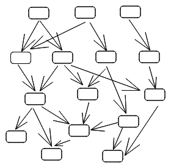
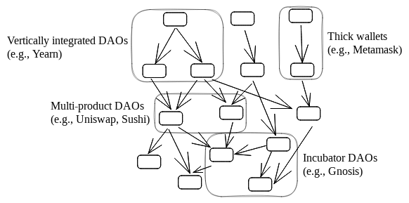

To whom it may concern,

We are the builders of the Meta-DAO. Please allow us 5 minutes to explain what the Meta-DAO is and how you might benefit from joining it.

We shall structure our writing in three sections:
- **Purpose**: why we need the Meta-DAO
- **Mechanics**: how the Meta-DAO will work
- **Why you should join**: self-explanatory

## Purpose

Have you ever worked at a big company? If you have, you know how soul-crushing they can be. 

Still, big companies survive. Because of economies of scale and scope, big companies are usually more economically efficient than their smaller counterparts. 

Decentralized finance (DeFi) is not immune from this. At its inception, most people believed that DeFi would exist as an interconnected ecosystem of micro-products ('financial legos').

As time has progressed, more and more people have woken up to the fact that DeFi also has economies of scale and scope, causing it to look more like the below.[^1]

The question that naturally arises is: 'will these DeFi organizations start looking like big companies?' **We intend to ensure that this does not happen. We will do so by building a radically new organization that can scale without adopting the practices of big companies (hierarchy, bureacracy, board of directors, et cetera).**

## Mechanics

For an organization to be scalable, it needs to solve one key problem: ensuring that the people in the organization are taking actions that benefit the organization as a whole. This is a problem because as an organization grows, each person has a smaller stake in the organization. Thus, their natural incentive will be to focus on taking as much as they can from the organization rather than growing the organization.[^2]

The Meta-DAO's approach to this problem is to shift decision-making power to algorithms and markets. As in existing DAOs, actions are proposed and enacted through improvement proposals. Unlike existing DAOs:
- The Meta-DAO is a federation of numerous 'members'. Members are analogous to divisions at a company, but they each have their own token.
- For each improvement proposal, the Meta-DAO uses a market-based mechanism called [futarchy](http://robinhanson.com/futarchy.html) to estimate that proposal's impact on the market capitalizations of members.
- When a proposal has a net-positive impact on the market capitalizations of members, the Meta-DAO executes it. If it has a net-negative impact, it disregards it.

A complete description of the mechanics can be found [here](https://github.com/metaDAObuilders/Manifesto/blob/main/Manifesto.pdf).

## Why you should join

Let us suppose that you are thinking "sure, this would be great once it gets scale, but I wouldn't join until then." In other words, you have decided that 'wait and see' is the optimal algorithm in this situation.

The problem is that if everyone adopted 'wait and see', the Meta-DAO would be stuck in a chicken-and-egg scenario. 

So, to prevent this from happening, we have adopted the common approach of network mining. Although tokenomics are still not finalized, it will go something like this:
1. $META will be the token of the Meta-DAO.
2. 50% of a member's token supply is automatically deposited into a common pool.
3. $META holders may redeem they tokens for their pro-rata share of member tokens.
4. Each epoch, an equal amount of $META will be distributed to each currently-active member, for the members to divvy up as they see fit.
5. The total amount of $META distributed per epoch will decline over time.

By point 5, early joiners of the Meta-DAO are likely to reap a large financial gain. 

### Footnotes

[^1]: Examples of DeFi DAOs that exploit economies of scale and/or scope include MakerDAO (many contributors focused on DAI optimization), Sushi (multiple products), Uniswap (multiple products), Fei/Rari before disbanding (multiple products), Gnosis (multiple products, although some have been spun out), Yearn (many contributors), and Curve (once it releases its stablecoin). Two main reasons for this consolidation are **product-optimization economies of scale** (simply, that bigger DAOs can affort to optimize more, which in turn makes them bigger) and **brand and community-driven economies of scope** (it is easier to launch a product under an existing brand than to develop a new brand and community). Note that as DeFi expands to mass market, both of these incentives are likely to get stronger because (1) a larger market allows for more optimization and (2) a mass-market customer is unlikely to be searching for new products, and will instead tend to stick with the products and brands they know.

[^2]: Managerial hierarchies are an attempt to resolve this problem by bringing the two in alignment. For example, those who contribute the most are given promotions, which in turn gives the contributor perks like a larger salary, more status, et cetera. More on this can be found here: TODO.